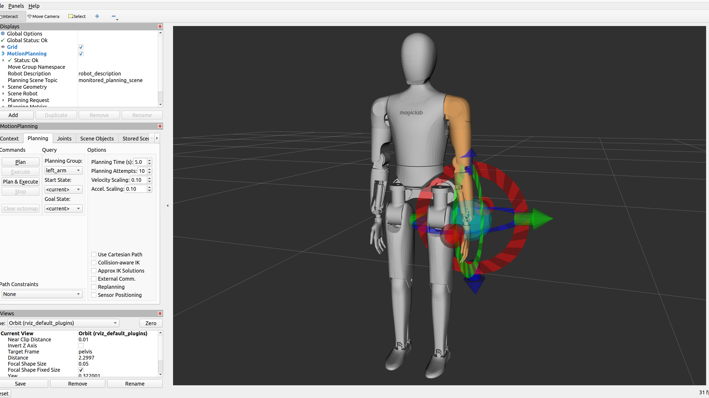

# Magicbot-Gen1 MoveIt Configuration

## Overview
This package includes [MoveIt2](https://moveit.picknik.ai/humble/) configuration and interface for the [Magicbot-Gen1](https://www.magiclab.top/human), developed by Magiclab Robotics.



## Prerequisites
```bash
sudo apt install ros-humble-moveit ros-humble-moveit-visual-tools
sudo apt install ros-humble-joint-state-broadcaster ros-humble-joint-trajectory-controller
sudo apt install ros-humble-ros2-control ros-humble-ros2-controllers ros-humble-controller-manager
```

## Usages
```bash
cd magicbot-gen1_moveit_config/src
git clone https://github.com/MagiclabRobotics/magicbot-gen1_description.git
colcon build
source install/setup.bash
ros2 launch magicbot-gen1_moveit_config demo.launch.py
```
Then you can drag markers in Rviz to interact with the robot.

In the second terminal
```bash
cd magicbot-gen1_moveit_config/src
source install/setup.bash
ros2 run magicbot-gen1_moveit_interface magicbot-gen1_moveit_interface
```
Then you will see in RViz that all four limbs of the robot move upward by 5 cm along the z-axis.
